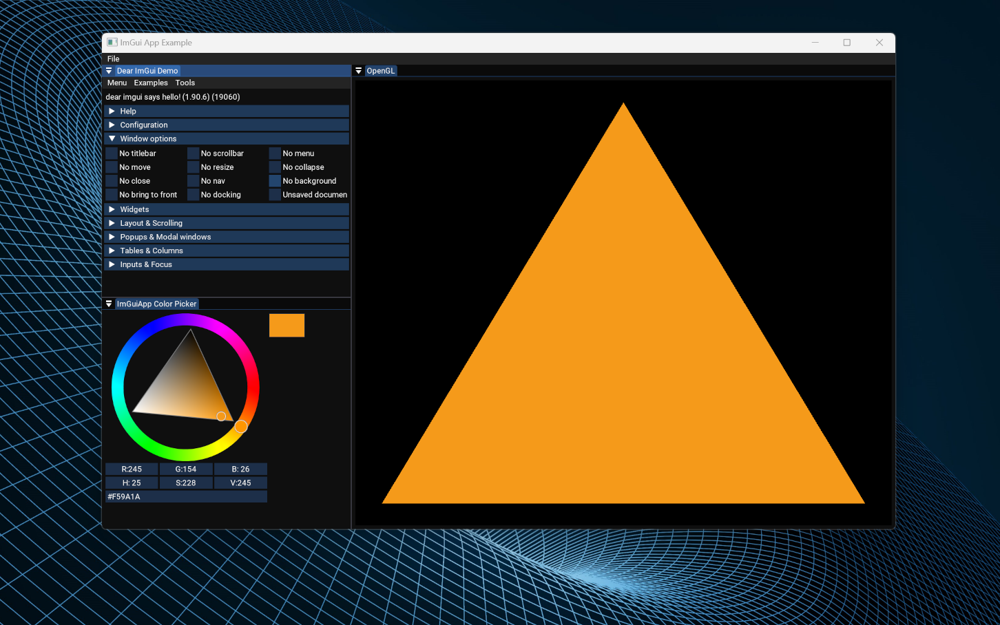

# ImGuiApp Project

[ImGuiApp](https://github.com/MasterpieceNKA/ImGuiApp) provides some basic functionality needed to quickly create C++ gui applications using the GLFW and OpenGL backends of [Dear ImGui](https://github.com/ocornut/imgui). [ImGuiApp](https://github.com/MasterpieceNKA/ImGuiApp) uses CMake and has been tested on Windows 11 (MinGW & Clang 18.1.5) and Linux (Ubuntu 22.04 with GNU 11.4.0 compiler). [ImGuiApp Demo Application](https://github.com/MasterpieceNKA/ImGuiApp_Demo) is a sample application developed using this project.

This project is inspired by [Walnut](https://github.com/StudioCherno/Walnut) which uses Vulkan instead of OpenGL.


## Requirements
- [CMake](https://cmake.org/)
- [Clang](https://clang.llvm.org/) or [MinGW](https://www.mingw-w64.org/) (Windows) or Your favorite Linux C++ compile (Linux)
- IDE of choice [Visual Studio Code](https://code.visualstudio.com/) (tested) or [Visual Studio 2022](https://visualstudio.com) (not fully tested)

## Getting Started
1. Run ```git init``` at the root folder of your project if you already havent done so.


2. Add ImGuiApp as a submodule of your project either in the root folder of your project
```
git submodule add https://github.com/MasterpieceNKA/ImGuiApp.git 
```
or in a folder where your other dependencies are located
```
git submodule add https://github.com/MasterpieceNKA/ImGuiApp.git dependencies/ImGuiApp
```

3. Add ImGuiApp subdirectory to your CMakeLists.txt file eg. if you added ImGuiApp to your root folder use
```
add_subdirectory(ImGuiApp)
```

4. Include ImGuiApp headers to your include directories
```
include_directories(${ImGuiApp_INCLUDE_DIR})
```

5. Link ImGuiApp to your project
```
target_link_libraries(<your executable's name> PUBLIC ImGuiApp)
```

## Sample ImGuiApp project setup

[ImGuiApp_Demo](https://github.com/MasterpieceNKA/ImGuiApp_Demo.git) is a sample project setup that uses ImGuiApp.




[ImGuiApp Demo Application](https://github.com/MasterpieceNKA/ImGuiApp_Demo)


[ImGuiApp Demo Application with undocked windows](https://github.com/MasterpieceNKA/ImGuiApp_Demo)


[ImGuiApp Demo Application 2](https://github.com/MasterpieceNKA/ImGuiApp_Demo)

MyCobot 320 Pi Pick and Place example
<video src="https://github.com/user-attachments/assets/77660176-cd32-4651-85e3-4542b71e9107" width="900px" controls autoplay></video>
\htmlonly
<iframe width="900px" height="507px" src="https://github.com/user-attachments/assets/77660176-cd32-4651-85e3-4542b71e9107" frameborder="0" allowfullscreen></iframe>
\endhtmlonly 


[Image of ImGuiApp sample project structures](https://github.com/MasterpieceNKA/ImGuiApp_Demo)


## 3rd party libaries
- [Dear ImGui](https://github.com/ocornut/imgui)
- [GLFW](https://github.com/glfw/glfw)
- [GLEW](https://github.com/nigels-com/glew)
- [GLM](https://github.com/g-truc/glm)
- [spdlog](https://github.com/gabime/spdlog)

## Additional
- ImGuiApp uses the [Roboto](https://fonts.google.com/specimen/Roboto) font ([Apache License, Version 2.0](https://www.apache.org/licenses/LICENSE-2.0))
- Documentation generated using [Doxygen](https://www.doxygen.nl/)

